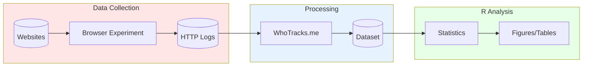

# Privacy vs. Profit: The Impact of Google's Manifest Version 3 (MV3) Update on Ad Blocker Effectiveness

[](https://arxiv.org/abs/2503.01000)
[](LICENSE)

**Authors:**
[Karlo Lukic](https://orcid.org/0000-0003-2745-6473) [](https://orcid.org/0000-0003-2745-6473) and
[Lazaros Papadopoulos](https://orcid.org/0009-0008-8011-2913) [](https://orcid.org/0009-0008-8011-2913)

**Affiliation:** Goethe University Frankfurt

**Venue:** Proceedings on Privacy Enhancing Technologies (PoPETs), Volume 2026, Issue 1

**Artifact:** [ARTIFACT-APPENDIX.md](ARTIFACT-APPENDIX.md) | Targeting: Available, Functional, Reproduced badges

## Abstract

Google's recent update to the manifest file for Chrome browser extensions, transitioning from manifest version 2 (MV2) to manifest version 3 (MV3), has raised concerns among users and ad blocker providers, who worry that the new restrictions, notably the shift from the powerful WebRequest API to the more restrictive DeclarativeNetRequest API, might reduce ad blocker effectiveness. Because ad blockers play a vital role for millions of users seeking a more private and ad-free browsing experience, this study empirically investigates how the MV3 update affects their ability to block ads and trackers.

Through a browser-based experiment conducted across multiple samples of ad-supported websites, we compare the MV3 to MV2 instances of four widely used ad blockers. Our results reveal **no statistically significant reduction in ad-blocking or anti-tracking effectiveness** for MV3 ad blockers compared to their MV2 counterparts, and in some cases, MV3 instances even exhibit slight improvements in blocking trackers. These findings are reassuring for users, indicating that the MV3 instances of popular ad blockers continue to provide effective protection against intrusive ads and privacy-infringing trackers. While some uncertainties remain, ad blocker providers appear to have successfully navigated the MV3 update, finding solutions that maintain the core functionality of their extensions.

## Repository Structure

| Directory | Contents |
|-----------|----------|
| [`01_data/`](01_data/) | Datasets (`.rds`, `.xlsx`) and [browser extensions](01_data/extensions/) |
| [`02_scripts/01_py/`](02_scripts/01_py/) | Python crawler scripts (data collection) |
| [`02_scripts/02_R/`](02_scripts/02_R/) | R analysis scripts (reproducible analysis) |
| [`03_results/`](03_results/) | Generated figures (`.pdf`) and tables (`.tex`) |
| [`renv/`](renv/) | R environment management |
| [`renv.lock`](renv.lock) | R dependency versions |

## Research Pipeline



**Reproducibility Note:**
- **Part 1 (Data Collection):** Scripts provided for methodology transparency. May require adjustments due to Chrome/extension updates since data collection.
- **Part 3 (Analysis):** Fully reproducible from provided datasets. Generates all paper figures and tables.

## Quick Start (R Analysis)

### Prerequisites
- R 4.4+ ([download](https://cran.r-project.org/))
- RStudio (recommended) or terminal
- gfortran (required for compiling some R packages)
    
### Steps

```bash
# 1. Clone the repository
git clone https://github.com/karlolukic/impact-of-google-mv3-on-ad-blocker-effectivenesss.git
cd impact-of-google-mv3-on-ad-blocker-effectivenesss

# 2. Open R and restore dependencies
R
```

```r
# In R console:
renv::restore()  # Install all required packages

# 3. Run the analysis
source("02_scripts/02_R/reproducible_analysis.R")
```

Output: Figures and tables saved to [`03_results/`](03_results/)

### Alternative Formats

The analysis is available in three formats:

| Format | File | Run Command |
|--------|------|-------------|
| R Script | [`reproducible_analysis.R`](02_scripts/02_R/reproducible_analysis.R) | `source(...)` |
| Quarto | [`reproducible_analysis.qmd`](02_scripts/02_R/reproducible_analysis.qmd) | `quarto render ...` |
| Jupyter | [`reproducible_analysis.ipynb`](02_scripts/02_R/reproducible_analysis.ipynb) | Jupyter with R kernel |

## Docker Reproduction (Recommended)

For fully reproducible results, use Docker to build and run the analysis in an isolated environment:

```bash
# Build the Docker image
docker build -t mv3-artifact .

# Run analysis and generate outputs
docker run --rm -v $(pwd)/03_results:/artifact/03_results mv3-artifact

# Verify outputs match reference checksums
docker run --rm mv3-artifact Rscript verify_outputs.R
```

**Expected runtime:** ~25 minutes (Docker build ~20 min, analysis ~5 min)

The Docker image includes:
- R 4.4.2 with all required packages (via `renv`)
- All system dependencies pre-installed
- Automatic verification of output integrity

## Ad Blockers Tested

| Ad Blocker | MV2 Instance | MV3 Instance |
|------------|--------------|--------------|
| Adblock Plus | Adblock Plus - free ad blocker (v3.25.1) | Adblock Plus - free ad blocker (v4.5.1) |
| AdGuard | AdGuard AdBlocker (v4.3.53) | AdGuard AdBlocker MV3 Beta (v5.0.33) |
| Stands | Stands AdBlocker (v2.1.24) | Fair AdBlocker MV3 Beta (v2.1.10) |
| uBlock | uBlock Origin (v1.59.0) | uBlock Origin Lite (v2024.8.12.902) |

## Key Findings

1. **No significant effectiveness reduction:** MV3 ad blockers perform comparably to MV2 versions
2. **Improved tracker blocking:** Some MV3 versions showed enhanced anti-tracking capabilities
3. **Successful adaptation:** Ad blocker developers effectively adapted to new API constraints

## Citation

If you use this artifact, please cite our paper:

```bibtex
@article{lukic2025privacy,
  title={Privacy vs. Profit: The Impact of Google's Manifest Version 3 (MV3) Update on Ad Blocker Effectiveness},
  author={Lukic, Karlo and Papadopoulos, Lazaros},
  journal={Proceedings on Privacy Enhancing Technologies},
  year={2026}
}
```

## Acknowledgments

This project has received funding from the European Research Council (ERC) under the European Union's Horizon 2020 research and innovation program (grant agreement No. 833714). Lazaros Papadopoulos acknowledges financial support from the German Academic Exchange Service (DAAD) and the German Research Foundation (DFG) under the TRR266 program (Project-ID 403041268).

## License

This project is licensed under the MIT License - see the [LICENSE](LICENSE) file for details.

## Contact

- [Karlo Lukic](https://orcid.org/0000-0003-2745-6473) - [GitHub](https://github.com/karlolukic)
- [Lazaros Papadopoulos](https://orcid.org/0009-0008-8011-2913)

For questions about the artifact, please open an issue.
